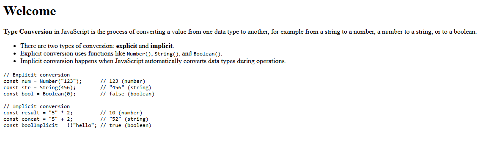
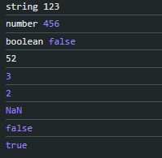

## 🖼️ Preview


## Example: Type Conversion in JavaScript

```javascript
// 1. String Conversion
let num = 123;
let str = String(num); // "123"
console.log(typeof str, str); // string "123"

// 2. Number Conversion
let strNum = "456";
let convertedNum = Number(strNum); // 456
console.log(typeof convertedNum, convertedNum); // number 456

// 3. Boolean Conversion
let value = 0;
let boolValue = Boolean(value); // false
console.log(typeof boolValue, boolValue); // boolean false

// 4. Implicit Type Conversion (Type Coercion)
console.log("5" + 2);    // "52" (number 2 is converted to string)
console.log("5" - 2);    // 3   (string "5" is converted to number)
console.log(true + 1);   // 2   (true is converted to 1)

// 5. Common Pitfalls
console.log(Number("abc")); // NaN
console.log(Boolean(""));   // false
console.log(Boolean("0"));  // true
```

## 📦 Console Output
