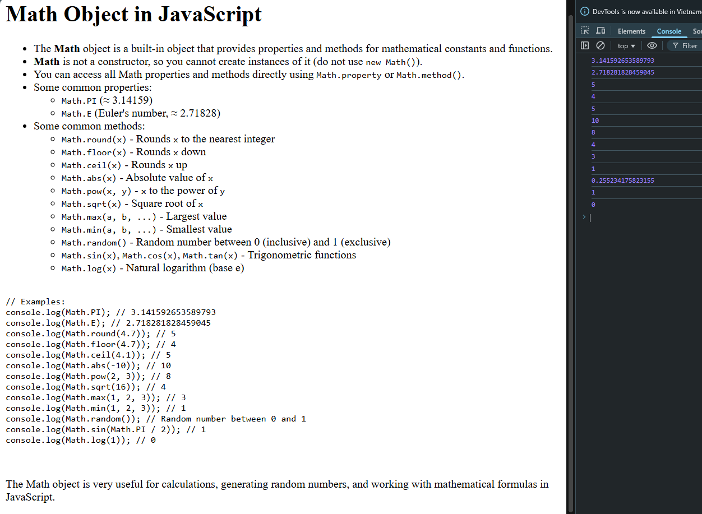

# Math Object in JavaScript

The **Math** object in JavaScript is a built-in object that provides a collection of properties and methods for mathematical constants and functions. It is not a constructor, so you cannot create instances of it (do not use `new Math()`). All properties and methods are accessed directly using `Math.property` or `Math.method()`.

## Common Properties

- `Math.PI` &mdash; The ratio of a circle's circumference to its diameter (≈ 3.14159)
- `Math.E` &mdash; Euler's number, the base of natural logarithms (≈ 2.71828)

## Common Methods

- `Math.round(x)` &mdash; Rounds `x` to the nearest integer
- `Math.floor(x)` &mdash; Rounds `x` down to the nearest integer
- `Math.ceil(x)` &mdash; Rounds `x` up to the nearest integer
- `Math.abs(x)` &mdash; Returns the absolute value of `x`
- `Math.pow(x, y)` &mdash; Returns `x` raised to the power of `y`
- `Math.sqrt(x)` &mdash; Returns the square root of `x`
- `Math.max(a, b, ...)` &mdash; Returns the largest value
- `Math.min(a, b, ...)` &mdash; Returns the smallest value
- `Math.random()` &mdash; Returns a random number between 0 (inclusive) and 1 (exclusive)
- `Math.sin(x)`, `Math.cos(x)`, `Math.tan(x)` &mdash; Trigonometric functions
- `Math.log(x)` &mdash; Returns the natural logarithm (base e) of `x`

## Examples

```javascript
console.log(Math.PI); // 3.141592653589793
console.log(Math.E); // 2.718281828459045
console.log(Math.round(4.7)); // 5
console.log(Math.floor(4.7)); // 4
console.log(Math.ceil(4.1)); // 5
console.log(Math.abs(-10)); // 10
console.log(Math.pow(2, 3)); // 8
console.log(Math.sqrt(16)); // 4
console.log(Math.max(1, 2, 3)); // 3
console.log(Math.min(1, 2, 3)); // 1
console.log(Math.random()); // Random number between 0 and 1
console.log(Math.sin(Math.PI / 2)); // 1
console.log(Math.log(1)); // 0
```

## 🖼️ Preview
