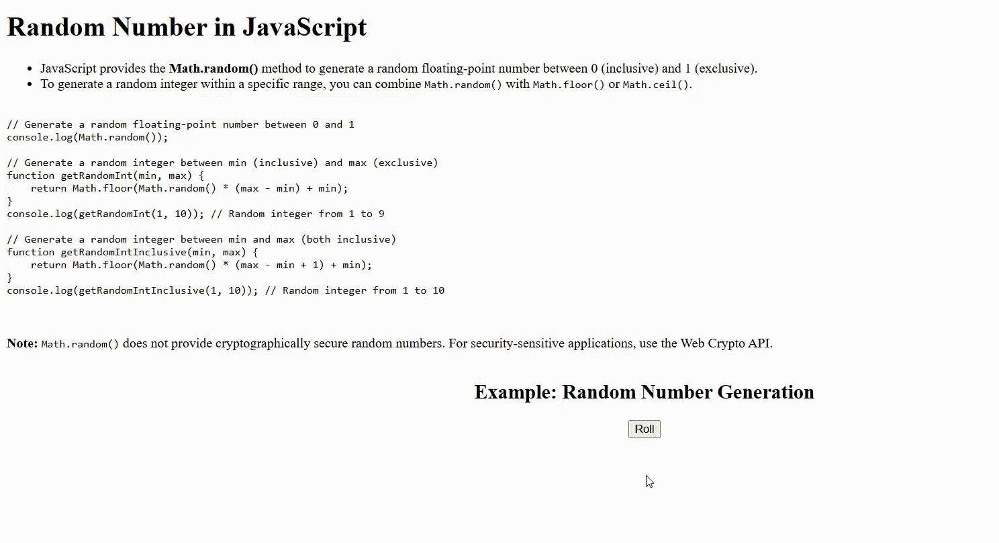

# Random Number in JavaScript

JavaScript provides the `Math.random()` method to generate random numbers. This method returns a floating-point number between 0 (inclusive) and 1 (exclusive).

## How to Generate Random Numbers

- **Random floating-point number between 0 and 1:**
    ```javascript
    console.log(Math.random());
    ```

- **Random integer between min (inclusive) and max (exclusive):**
    ```javascript
    function getRandomInt(min, max) {
        return Math.floor(Math.random() * (max - min) + min);
    }
    console.log(getRandomInt(1, 10)); // Random integer from 1 to 9
    ```

- **Random integer between min and max (both inclusive):**
    ```javascript
    function getRandomIntInclusive(min, max) {
        return Math.floor(Math.random() * (max - min + 1) + min);
    }
    console.log(getRandomIntInclusive(1, 10)); // Random integer from 1 to 10
    ```

## Note

> `Math.random()` does **not** provide cryptographically secure random numbers.  
> For security-sensitive applications, use the Web Crypto API.

## Example

