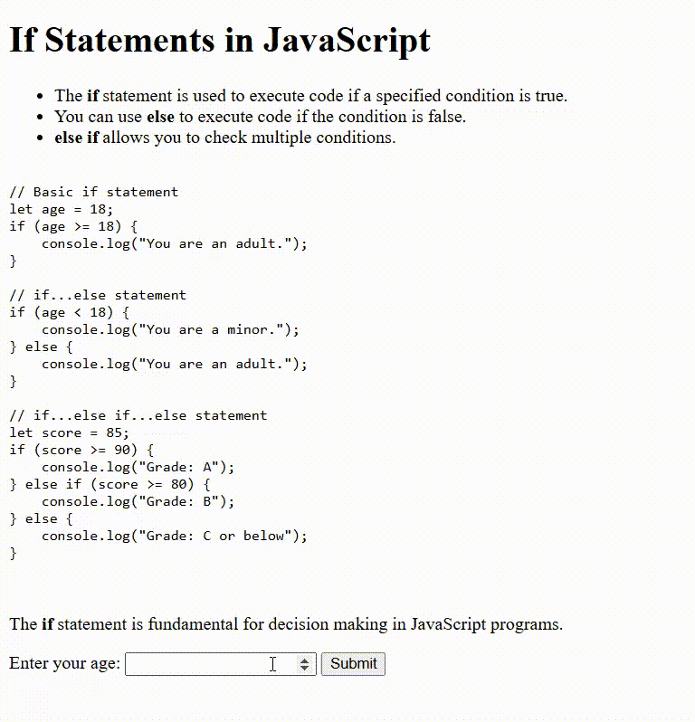

# If Statements in JavaScript

This project demonstrates how to use `if`, `else if`, and `else` statements in JavaScript for decision making.

## Features

- Explains the usage of `if`, `else if`, and `else` statements.
- Provides code examples for different conditions.
- Includes a simple interactive demo:  
  Enter your age and click **Submit** to see a message based on your input.

## Example Code

```javascript
let age = 18;
if (age >= 18) {
    console.log("You are an adult.");
} else {
    console.log("You are a minor.");
}
```

## Interactive Demo

1. Enter your age in the input box.
2. Click the **Submit** button.
3. The program will display:
   - "Age cannot be zero." if age is 0
   - "You have reached a century or more!" if age is 100 or more
   - "You are an adult." if age is 18 or more (but less than 100)
   - "You are a minor." if age is less than # If Statements in JavaScript

This project demonstrates how to use `if`, `else if`, and `else` statements in JavaScript for decision making.

## Features

- Explains the usage of `if`, `else if`, and `else` statements.
- Provides code examples for different conditions.
- Includes a simple interactive demo:  
  Enter your age and click **Submit** to see a message based on your input.

## Example Code

```javascript
let age = 18;
if (age >= 18) {
    console.log("You are an adult.");
} else {
    console.log("You are a minor.");
}
```

## Interactive Demo

1. Enter your age in the input box.
2. Click the **Submit** button.
3. The program will display:
   - "Age cannot be zero." if age is 0
   - "You have reached a century or more!" if age is 100 or more
   - "You are an adult." if age is 18 or more (but less than 100)
   - "You are a minor." if age is less than 

## 🖼️ Preview

