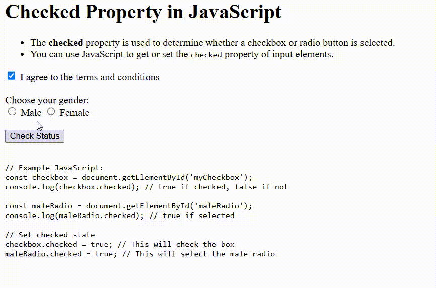

# Checked Property in JavaScript

This project demonstrates how to use the `checked` property in JavaScript to work with checkboxes and radio buttons.

## Features

- Explains the usage of the `checked` property for input elements.
- Shows how to check if a checkbox or radio button is selected.
- Interactive demo: displays the status of a checkbox and radio buttons when you click a button.

## How It Works

- The **checkbox** lets users agree to terms and conditions.
- The **radio buttons** let users select their gender.
- When you click the **Check Status** button, the script displays which options are selected.

## Example Code

```javascript
const checkbox = document.getElementById('myCheckbox');
console.log(checkbox.checked); // true if checked, false if not

const maleRadio = document.getElementById('maleRadio');
console.log(maleRadio.checked); // true if selected

// Set checked state
checkbox.checked = true; // This will check the box
maleRadio.checked = true; // This will select the male radio
```

## Usage

1. Check or uncheck the checkbox.
2. Select a gender using the radio buttons.
3. Click **Check Status** to see the result.

## Preview

