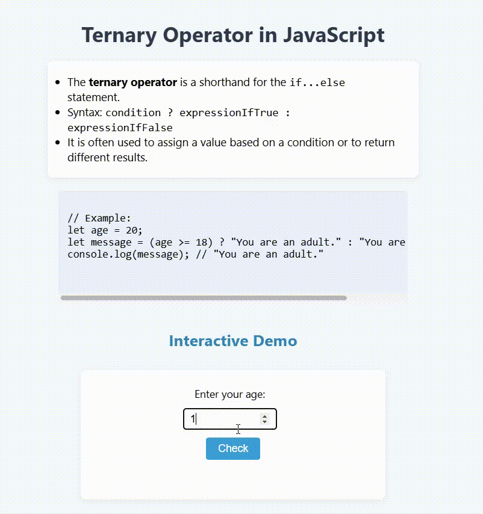

# Ternary Operator in JavaScript

This project demonstrates how to use the **ternary operator** (`? :`) in JavaScript as a concise alternative to the `if...else` statement.

## Features

- Explains the syntax and usage of the ternary operator.
- Provides example code for quick understanding.
- Includes an interactive demo: enter your age and instantly see the result using the ternary operator.

## What is the Ternary Operator?

The ternary operator is a shorthand for simple `if...else` statements.  
**Syntax:**  
```javascript
condition ? expressionIfTrue : expressionIfFalse
```

## Example

```javascript
let age = 20;
let message = (age >= 18) ? "You are an adult." : "You are a minor.";
console.log(message); // "You are an adult."
```

## Interactive Demo

1. Enter your age in the input box.
2. Click the **Check** button.
3. The program will display:
   - "You are an adult." if age is 18 or older
   - "You are a minor." if age is less than 18

## Preview

