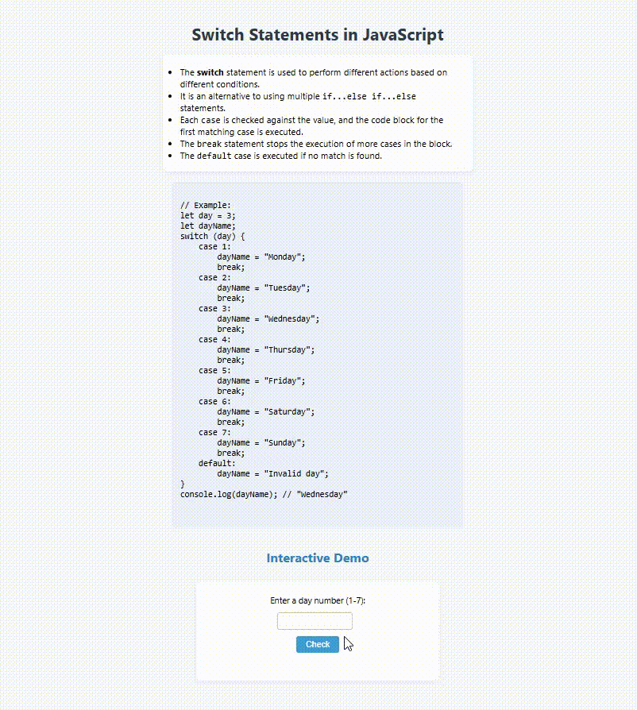

# Switch Statements in JavaScript

This project demonstrates how to use the `switch` statement in JavaScript to perform different actions based on different conditions.

## Features

- Explains the syntax and usage of the `switch` statement.
- Provides a clear code example for reference.
- Includes an interactive demo: enter a day number (1-7) and see the corresponding day name.

## What is a Switch Statement?

The `switch` statement is an alternative to multiple `if...else if...else` statements. It checks a value against multiple cases and executes the code block for the first matching case.

**Syntax:**
```javascript
switch (expression) {
    case value1:
        // code block
        break;
    case value2:
        // code block
        break;
    default:
        // code block
}
```

## Example

```javascript
let day = 3;
let dayName;
switch (day) {
    case 1:
        dayName = "Monday";
        break;
    case 2:
        dayName = "Tuesday";
        break;
    case 3:
        dayName = "Wednesday";
        break;
    case 4:
        dayName = "Thursday";
        break;
    case 5:
        dayName = "Friday";
        break;
    case 6:
        dayName = "Saturday";
        break;
    case 7:
        dayName = "Sunday";
        break;
    default:
        dayName = "Invalid day";
}
console.log(dayName); // "Wednesday"
```

## Interactive Demo

1. Enter a day number (1-7) in the input box.
2. Click the **Check** button.
3. The program will display the corresponding day name or "Invalid day number!" if the input is not valid.

## Preview

