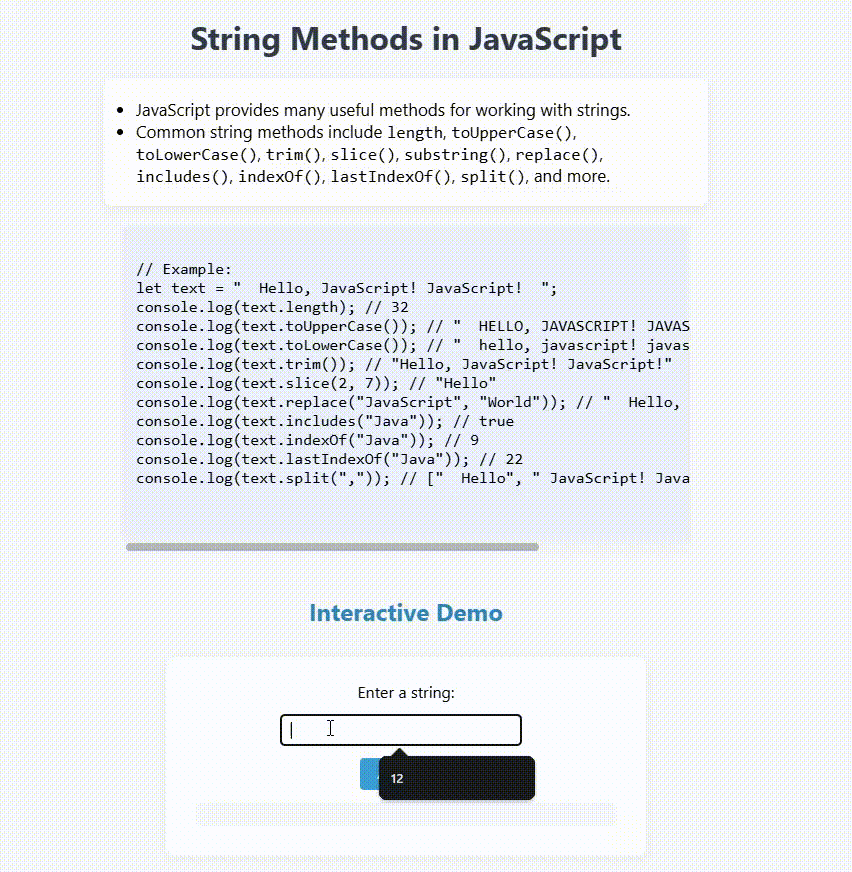

# String Methods in JavaScript

This project demonstrates how to use common string methods in JavaScript to manipulate and analyze text.

## Features

- Lists and explains popular string methods such as `length`, `toUpperCase()`, `toLowerCase()`, `trim()`, `slice()`, `substring()`, `replace()`, `includes()`, `indexOf()`, `lastIndexOf()`, and `split()`.
- Provides example code for each method.
- Includes an interactive demo: enter a string and see various string methods applied to your input.

## Example Code

```javascript
let text = "  Hello, JavaScript! JavaScript!  ";
console.log(text.length); // 32
console.log(text.toUpperCase()); // "  HELLO, JAVASCRIPT! JAVASCRIPT!  "
console.log(text.toLowerCase()); // "  hello, javascript! javascript!  "
console.log(text.trim()); // "Hello, JavaScript! JavaScript!"
console.log(text.slice(2, 7)); // "Hello"
console.log(text.replace("JavaScript", "World")); // "  Hello, World! JavaScript!  "
console.log(text.includes("Java")); // true
console.log(text.indexOf("Java")); // 9
console.log(text.lastIndexOf("Java")); // 22
console.log(text.split(",")); // ["  Hello", " JavaScript! JavaScript!  "]
```

## Interactive Demo

1. Enter a string in the input box.
2. Click the **Analyze** button.
3. The program will display:
   - Length
   - Uppercase and lowercase versions
   - Trimmed version
   - Slice (1, 5)
   - Whether it includes "a"
   - Index and last index of "a"
   - Split by space

## Preview

