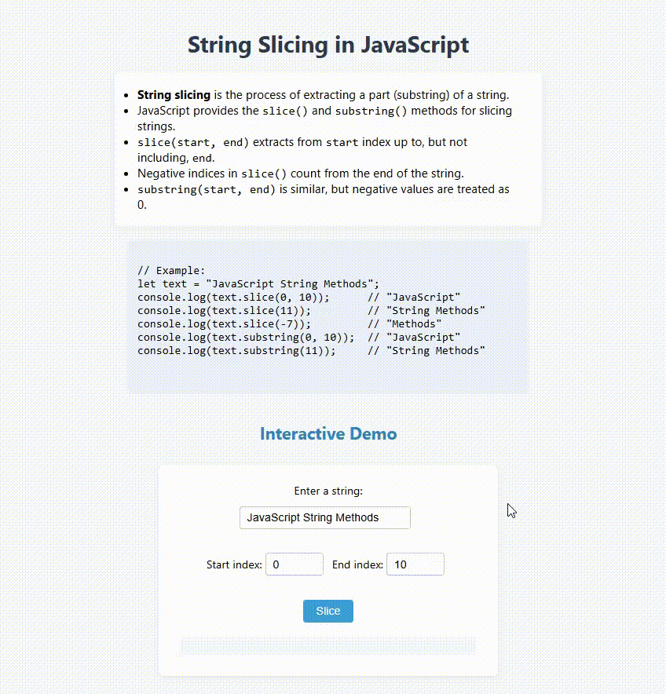

# String Slicing in JavaScript

This project demonstrates how to extract substrings from a string using JavaScript's `slice()` and `substring()` methods.

## Features

- Explains the difference between `slice()` and `substring()`.
- Shows how negative indices work with `slice()`.
- Provides example code for both methods.
- Includes an interactive demo: enter a string and indices to see the result of slicing.

## Example Code

```javascript
let text = "JavaScript String Methods";
console.log(text.slice(0, 10));      // "JavaScript"
console.log(text.slice(11));         // "String Methods"
console.log(text.slice(-7));         // "Methods"
console.log(text.substring(0, 10));  // "JavaScript"
console.log(text.substring(11));     // "String Methods"
```

## Interactive Demo

1. Enter a string in the input box.
2. Enter start and end indices.
3. Click the **Slice** button.
4. The program will display the result of both `slice()` and `substring()`.

## Preview

