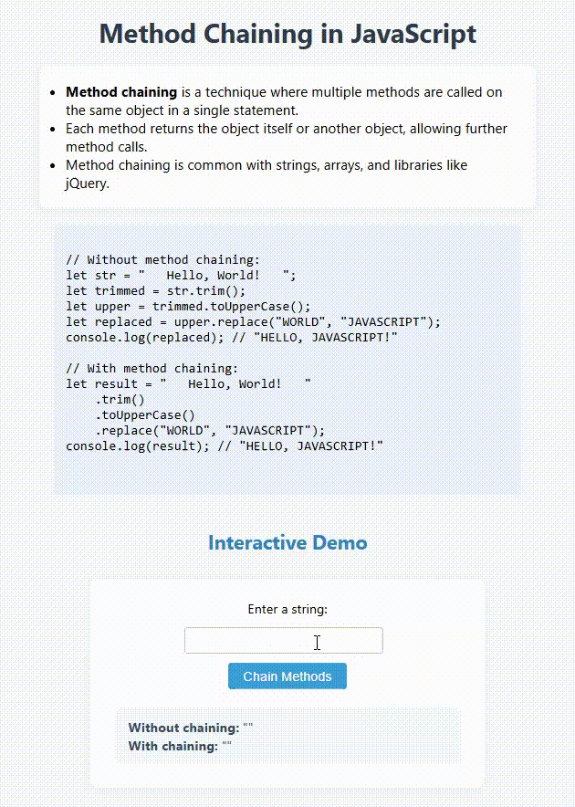

# Method Chaining in JavaScript

This project demonstrates the concept of **method chaining** in JavaScript, showing both the traditional approach and the chaining approach for calling multiple methods on the same object.

## Features

- Explains what method chaining is and why it's useful.
- Shows the difference between using and not using method chaining.
- Provides example code for both approaches.
- Includes an interactive demo: enter a string and see the results with and without method chaining.

## What is Method Chaining?

Method chaining is a technique where multiple methods are called on the same object in a single statement. Each method returns the object itself or another object, allowing further method calls. This is common with strings, arrays, and libraries like jQuery.

## Example

```javascript
// Without method chaining:
let str = "   Hello, World!   ";
let trimmed = str.trim();
let upper = trimmed.toUpperCase();
let replaced = upper.replace("WORLD", "JAVASCRIPT");
console.log(replaced); // "HELLO, JAVASCRIPT!"

// With method chaining:
let result = "   Hello, World!   "
    .trim()
    .toUpperCase()
    .replace("WORLD", "JAVASCRIPT");
console.log(result); // "HELLO, JAVASCRIPT!"
```

## Interactive Demo

1. Enter a string in the input box.
2. Click the **Chain Methods** button.
3. The program will display the result both with and without method chaining.

## Preview

