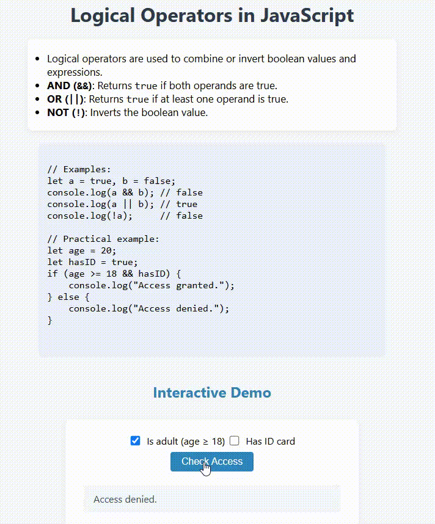

# Logical Operators in JavaScript

This project demonstrates how to use logical operators (`&&`, `||`, `!`) in JavaScript to combine or invert boolean values and expressions.

## Features

- Explains the AND (`&&`), OR (`||`), and NOT (`!`) operators.
- Provides example code for each operator.
- Includes an interactive demo: checkboxes to simulate access control logic.

## Example Code

```javascript
let a = true, b = false;
console.log(a && b); // false
console.log(a || b); // true
console.log(!a);     // false

// Practical example:
let age = 20;
let hasID = true;
if (age >= 18 && hasID) {
    console.log("Access granted.");
} else {
    console.log("Access denied.");
}
```

## Interactive Demo

1. Check or uncheck the "Is adult" and "Has ID card" boxes.
2. Click **Check Access**.
3. The program will display "Access granted." only if both are checked.

## Preview

