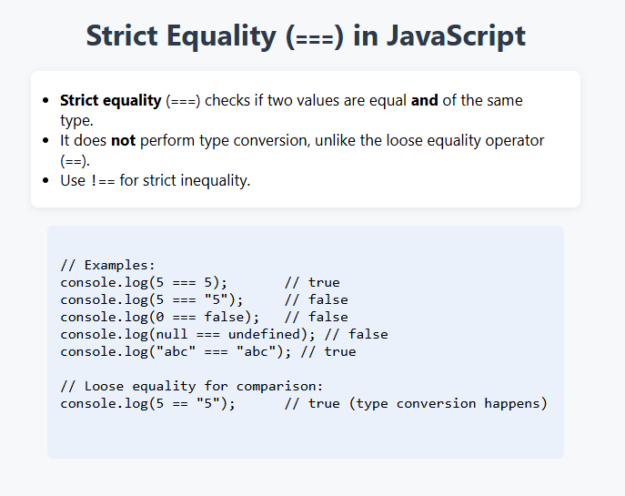

# Strict Equality in JavaScript

This project demonstrates the use of the strict equality operator (`===`) in JavaScript and compares it with the loose equality operator (`==`).

## Features

- Explains the difference between strict equality (`===`) and loose equality (`==`).
- Provides example code for both operators.
- Includes an interactive demo: enter two values and see the result of both strict and loose equality comparisons.

## Example Code

```javascript
console.log(5 === 5);       // true
console.log(5 === "5");     // false
console.log(0 === false);   // false
console.log(null === undefined); // false
console.log("abc" === "abc"); // true

// Loose equality for comparison:
console.log(5 == "5");      // true (type conversion happens)
```

## Preview

