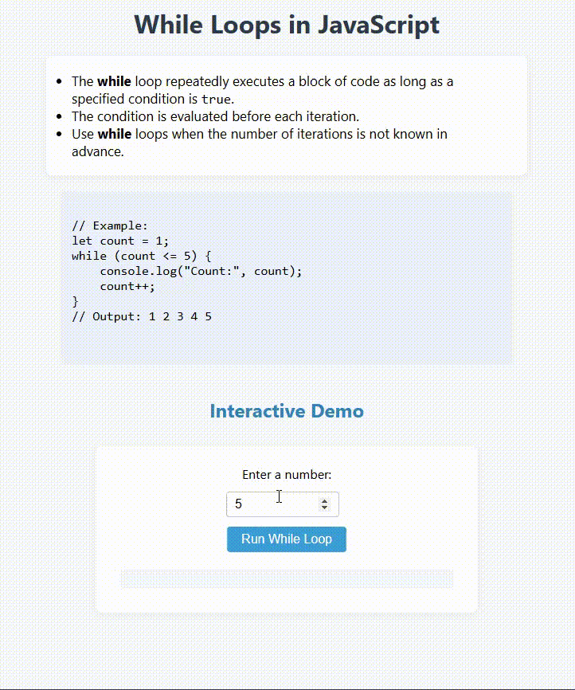

# While Loops in JavaScript

This project demonstrates how to use the `while` loop in JavaScript to repeatedly execute a block of code as long as a specified condition is `true`.

## Features

- Explains the syntax and use cases for `while` loops.
- Provides example code for a simple counting loop.
- Includes an interactive demo: enter a number and see the loop in action.

## Example Code

```javascript
let count = 1;
while (count <= 5) {
    console.log("Count:", count);
    count++;
}
// Output: 1 2 3 4 5
```

## Interactive Demo

1. Enter a number in the input box.
2. Click the **Run While Loop** button.
3. The program will display the count from 1 up to your number.

## Preview

