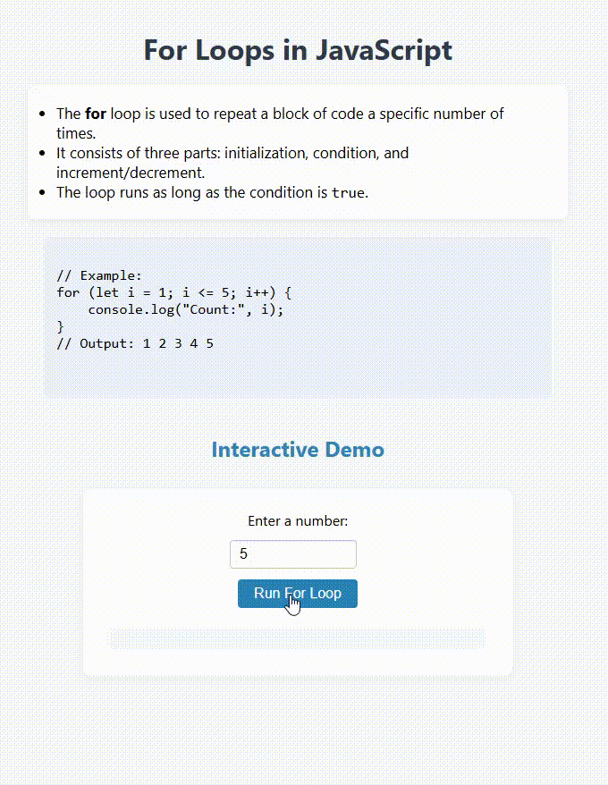

# For Loops in JavaScript

This project demonstrates how to use the `for` loop in JavaScript to repeat a block of code a specific number of times.

## Features

- Explains the syntax and use cases for `for` loops.
- Provides example code for a simple counting loop.
- Includes an interactive demo: enter a number and see the loop in action.

## Example Code

```javascript
for (let i = 1; i <= 5; i++) {
    console.log("Count:", i);
}
// Output: 1 2 3 4 5
```

## Interactive Demo

1. Enter a number in the input box.
2. Click the **Run For Loop** button.
3. The program will display the count from 1 up to your number.

## Preview

