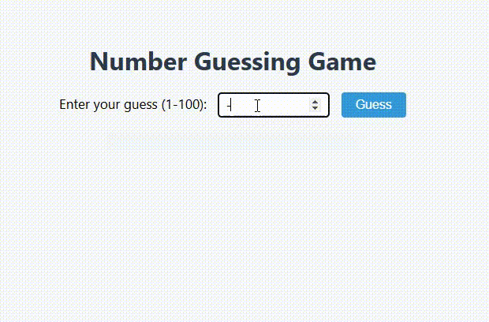

# Number Guessing Game

This project is a simple number guessing game built with JavaScript.

## How to Play

- The computer randomly selects a number between 1 and 100.
- Enter your guess in the input box and click **Guess**.
- The game will tell you if your guess is "Too large", "Too small", or "Correct!".
- If you guess correctly, it will show how many attempts you took.
- If you enter a number less than 1 or greater than 100, you will be prompted to enter a valid number.

## Features

- Input validation for numbers outside 1-100.
- Tracks the number of attempts.
- User-friendly messages and styling.

## Example Code

```javascript
let randomNumber = Math.floor(Math.random() * 100) + 1;
let attempts = 0;
let guessedCorrectly = false;

document.getElementById("guessBtn").onclick = function() {
    if (guessedCorrectly) return;

    let numberGuess = Number(document.getElementById("number").value);

    if (numberGuess < 1 || numberGuess > 100) {
        document.getElementById("output").textContent = "Please enter a number between 1 and 100.";
        return;
    }

    attempts++;

    if (numberGuess === randomNumber) {
        document.getElementById("output").textContent = `Correct! You guessed it in ${attempts} attempts.`;
        guessedCorrectly = true;
    } else if (numberGuess > randomNumber) {
        document.getElementById("output").textContent = "Too large! TRY AGAIN";
    } else {
        document.getElementById("output").textContent = "Too small! TRY AGAIN";
    }
};
```

## Preview

