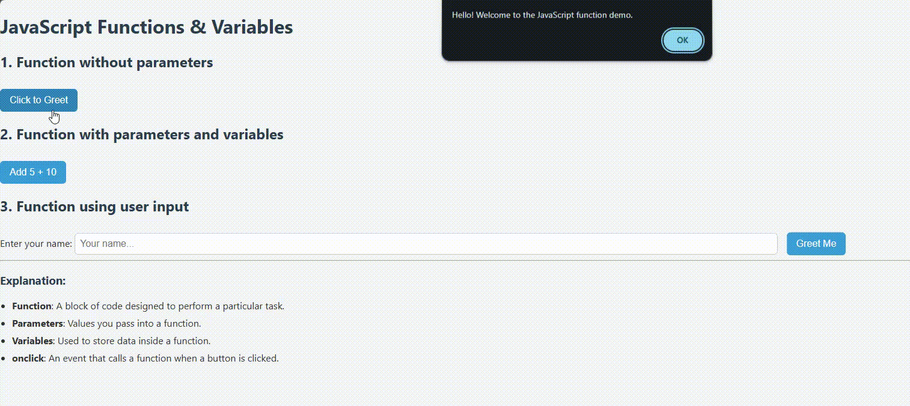

## 📝 JavaScript Functions & Variables Demo

This is a simple web demo that explains and demonstrates how to use **functions** and **variables** in JavaScript. It includes examples such as basic greeting, adding numbers, and interacting with user input. The page is styled with a custom `style.css` file for better appearance.

### 📷 Preview

