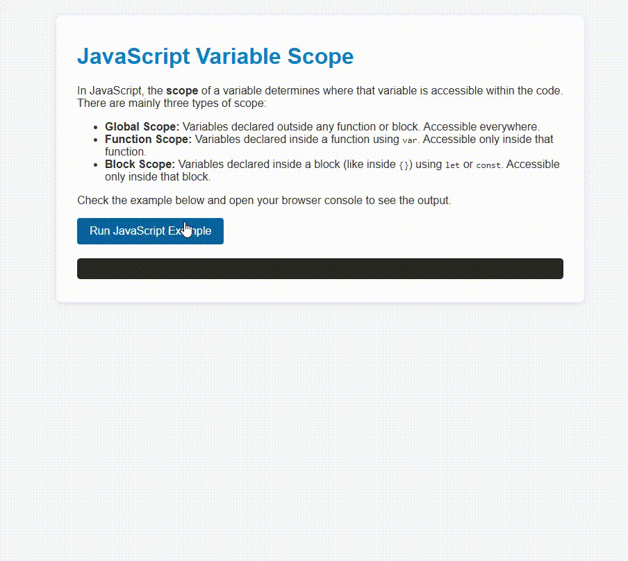

# JavaScript Variable Scope Explanation

This project demonstrates the concept of **variable scope** in JavaScript with a simple example.

## What is Variable Scope?

In JavaScript, **scope** defines the accessibility or lifetime of variables and functions in different parts of your code. Understanding scope is crucial to avoid bugs and write clean code.

There are three main types of scope in JavaScript:

- **Global Scope**: Variables declared outside any function or block are global and can be accessed anywhere.
- **Function Scope**: Variables declared inside a function with `var` are scoped to that function only.
- **Block Scope**: Variables declared with `let` or `const` inside a block `{ ... }` are limited to that block.

## How to Use

1. Open `index.html` in a modern web browser.
2. Click the **Run JavaScript Example** button.
3. The results will be displayed below the button, demonstrating the different scopes.

## Files

- `index.html` - Contains the webpage structure and explanation.
- `index.js` - Contains the JavaScript code demonstrating variable scopes.
- `style.css` - Styles the webpage for better readability.
- `README.md` - This documentation file.

---

Feel free to explore the code and experiment with variable declarations to see how scope works in JavaScript!

## Preview
