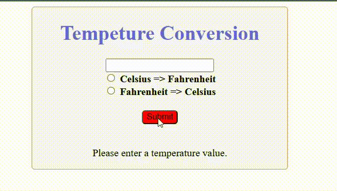

# 🌡️ Temperature Converter Web App

This is a simple web application built with HTML, CSS, and JavaScript that allows users to convert temperature values between Celsius and Fahrenheit.


---

## 📂 File Structure

```

temperature_converter_program/
├── index.html       # Main HTML page
├── style.css        # Styling for the page
├── index.js         # JavaScript logic for conversion
├── gif/preview.gif         # A demonstration animation of the app
└── README.md        # Project documentation
```
 
---

## 📸 Preview



---

## 🚀 Features

- Convert temperature from **Celsius to Fahrenheit**
- Convert temperature from **Fahrenheit to Celsius**
- Simple, clean, and responsive user interface
- Error messages when input or options are missing

---

