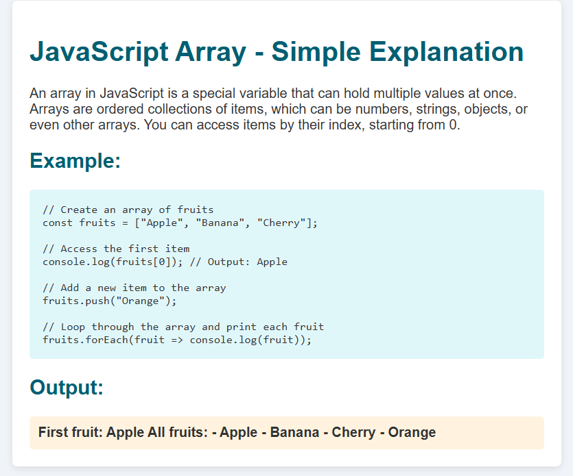

# JavaScript Array Example

This is a simple example project demonstrating the basic usage of arrays in JavaScript.

## Contents

- **index.html**: The main HTML file showing the description, example code, and output.
- **style.css**: Styles for the page for better readability.
- **index.js**: JavaScript file containing description, example code, and dynamic output.
- **readme.md**: This readme file.

## How to use

Open `index.html` in any modern browser to see the explanation, example code, and output of JavaScript arrays.

---

### What is a JavaScript Array?

An array is a collection of values stored in an ordered list. Items can be accessed by their index, starting at 0.

---

### Example features shown:

- Creating an array
- Accessing items by index
- Adding items using `.push()`
- Looping through arrays using `.forEach()`

## Preview
