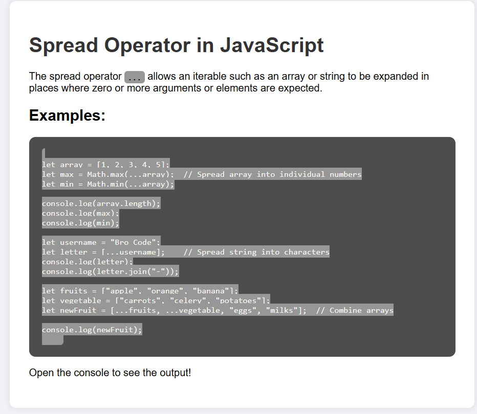

## 🧠 What is the Spread Operator?

The **spread operator** (`...`) allows you to expand iterable elements (like arrays or strings) into individual elements.

It is commonly used to:

- Copy arrays
- Combine arrays
- Spread values as function arguments
- Convert strings to character arrays

---

## 💡 Examples

### 1. Find max and min from an array:

```js
let array = [1, 2, 3, 4, 5];
let max = Math.max(...array);
let min = Math.min(...array);
````

### 2. Spread a string into characters:

```js
let username = "Bro Code";
let letter = [...username]; // ['B','r','o',' ','C','o','d','e']
```

### 3. Combine multiple arrays:

```js
let fruits = ["apple", "orange", "banana"];
let vegetable = ["carrots", "celery", "potatoes"];
let newFruit = [...fruits, ...vegetable, "eggs", "milks"];
```

---

## 📂 Project Structure

```
spread-operator-demo/
│
├── index.html        # Main HTML page
├── style.css         # Styling
├── index.js          # JavaScript logic
├── readme.md         # Documentation
└── screenshots/
    └── preview.png   # Screenshot of the webpage
```

---

## 🔍 Output Preview

You can open `index.html` in your browser and check the console (`F12` or right-click → Inspect → Console) to view the outputs.

---

## 🖼️Preview
