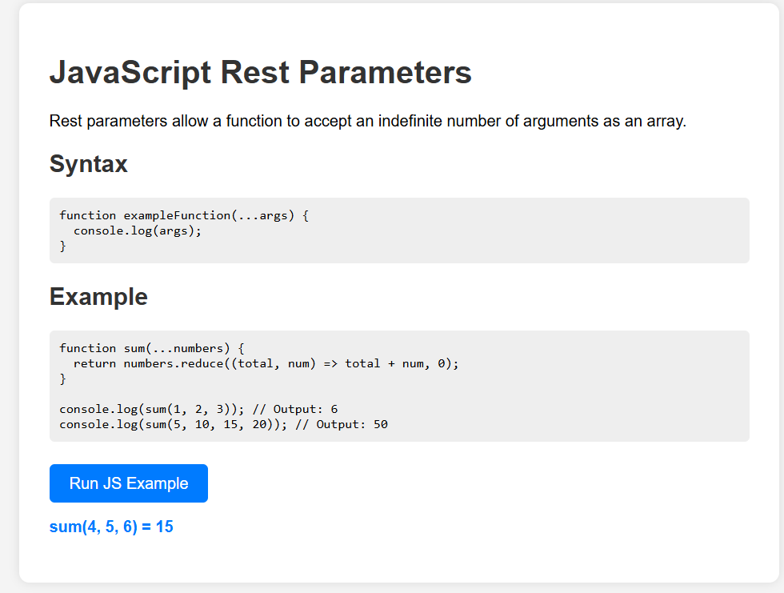

# JavaScript Rest Parameters

This project demonstrates the usage of **Rest Parameters** in JavaScript.

## 📖 What are Rest Parameters?

Rest parameters allow you to represent an indefinite number of arguments as an array.

### Syntax

```javascript
function functionName(...args) {
  // args is an array
}
```
## Preview
