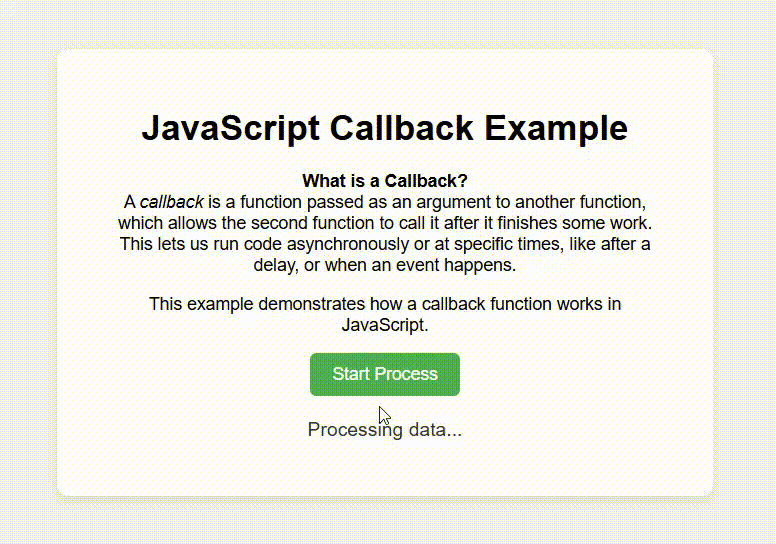

## 📖 What is a Callback?

A **callback** is a function passed as an argument to another function, which is then invoked inside the outer function to complete some action or logic.

### 🔍 Example in this project:

We simulate data processing using `setTimeout` and call a callback to display the result after 2 seconds.

## 🧠 How it works

1. `startProcess()` triggers the `processData()` function.
2. `processData()` shows "Processing data..." and waits for 2 seconds.
3. After 2 seconds, it calls the callback `displayResult()` with the final message.
4. `displayResult()` updates the UI with "Data processed!".

## 🖥 Preview

## 🛠 How to Run

1. Clone or download the repository.
2. Open `index.html` in your browser.
3. Click the **Start Process** button to see how the callback works.
