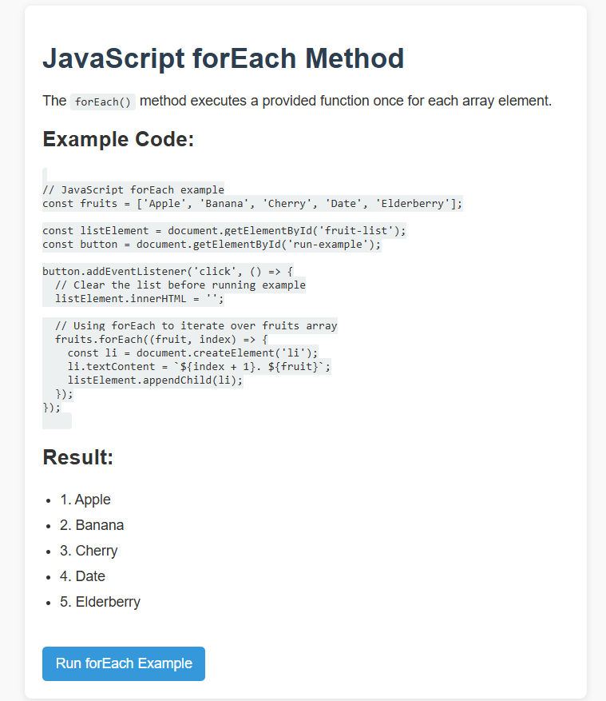

# JavaScript forEach Example

This project demonstrates how to use the JavaScript `forEach()` method to iterate over an array and display the results in the browser.

## 📘 What is `forEach()`?

The `forEach()` method executes a provided function once for each array element. It is a cleaner and more readable alternative to traditional `for` loops, especially when you want to perform an action on every item in an array.

### 🔧 Syntax

```js
array.forEach(function(currentValue, index, array) {
  // your code here
});
````

* **`currentValue`** – The current element being processed.
* **`index`** (optional) – The index of the current element.
* **`array`** (optional) – The array being traversed.

---

## 💡 Example

When you click the **"Run forEach Example"** button, the JavaScript code will loop through an array of fruits and display each item as a list element on the page.

### Sample Code

```js
const fruits = ['Apple', 'Banana', 'Cherry', 'Date', 'Elderberry'];

const listElement = document.getElementById('fruit-list');
const button = document.getElementById('run-example');

button.addEventListener('click', () => {
  listElement.innerHTML = '';

  fruits.forEach((fruit, index) => {
    const li = document.createElement('li');
    li.textContent = `${index + 1}. ${fruit}`;
    listElement.appendChild(li);
  });
});
```

---

## 🖼️ Preview

Here is a screenshot of the webpage after clicking the button:



---

## 🚀 How to Run

1. Clone or download this repository.
2. Open `index.html` in your browser.
3. Click the **"Run forEach Example"** button to see the result.

---

## 📁 File Structure

```
forEach-example/
├── index.html         # Main HTML file
├── style.css          # Styling for the page
├── index.js           # JavaScript logic with forEach
├── preview.png        # Screenshot preview of the page
└── README.md          # Project documentation
```

