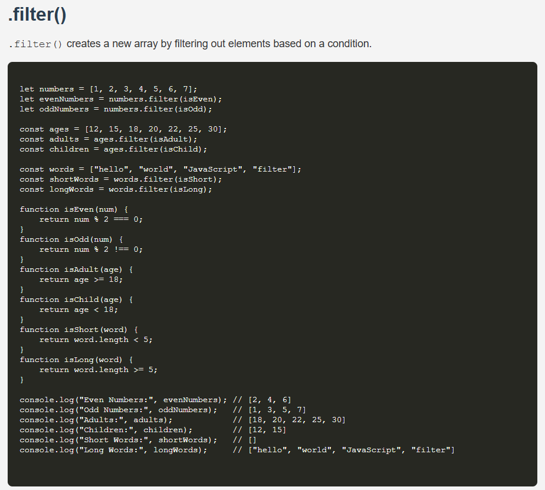

# JavaScript .filter() Example

This project demonstrates how the `.filter()` method works in JavaScript to create new arrays by filtering elements based on specified conditions.

## 📚 Description

The `.filter()` method is used to iterate over an array and return a new array containing only the elements that satisfy a given condition (callback function).

This example includes:
- Filtering even and odd numbers
- Filtering adults and children from an age list
- Filtering short and long words based on character length

## 📁 Project Structure

```

filter-method-example/
├── index.html     # Main HTML file displaying the example
├── style.css      # Stylesheet for basic formatting
├── index.js       # JavaScript logic for filtering arrays
└── README.md      # Project documentation
└── screenshots/image.png # Preview
````

## 🚀 How to Run

1. Clone or download this repository.
2. Open `index.html` in your browser.
3. Open the browser developer console (F12) to see the `.filter()` results.

## 🧠 Examples Used

```javascript
// Filter even numbers
let evenNumbers = numbers.filter(isEven);

// Filter adults
let adults = ages.filter(isAdult);

// Filter short words
let shortWords = words.filter(isShort);
````

## 📌 Key Functions

* `isEven(num)`: Checks if a number is divisible by 2.
* `isOdd(num)`: Checks if a number is not divisible by 2.
* `isAdult(age)`: Checks if age is 18 or above.
* `isChild(age)`: Checks if age is below 18.
* `isShort(word)`: Checks if word length is less than 5.
* `isLong(word)`: Checks if word length is 5 or more.

## 🖼️ Preview

