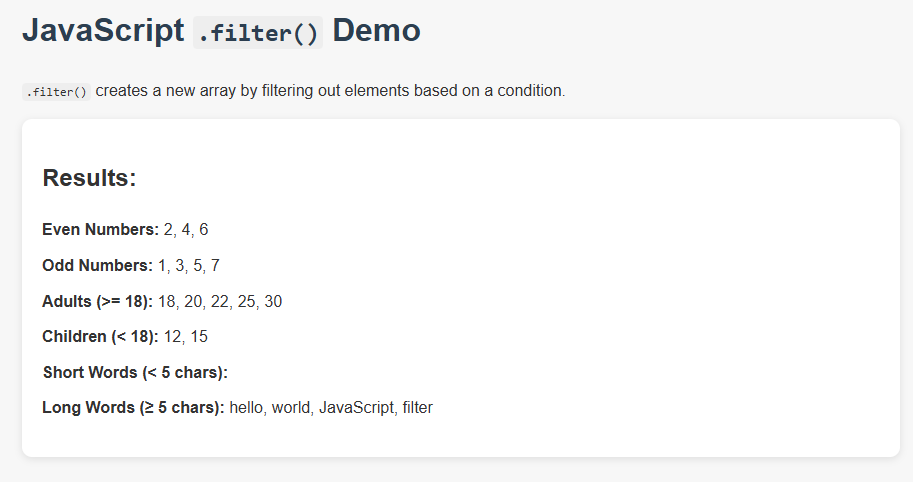

# JavaScript .filter() Demo

This project demonstrates how to use the `.filter()` method in JavaScript to create new arrays based on specific conditions.

## 📌 Description

The `.filter()` method creates a new array with all elements that pass the test implemented by the provided function. This simple web project shows how `.filter()` can be applied to:

- Numbers (even, odd)
- Ages (adults, children)
- Words (short, long)

Results are displayed directly on the webpage.

## 💻 Demo Preview



## 📁 Project Structure

```

filter-demo/
├── index.html       # Main HTML page
├── index.js         # JavaScript logic for filtering and displaying results
├── style.css        # Basic styling for the page
└── README.md        # Project documentation
└── screenshots/image.png #Preview

```

## 🔧 How to Use

1. Clone or download the repository.
2. Open `index.html` in your web browser.
3. View the filtered results displayed on the page.

No external libraries are required — pure HTML, CSS, and JavaScript.

## 🧠 Topics Covered

- JavaScript `.filter()` method
- Callback functions for filtering logic
- DOM manipulation to display results

## ✅ Example Output

```

Even Numbers: 2, 4, 6
Odd Numbers: 1, 3, 5, 7
Adults: 18, 20, 22, 25, 30
Children: 12, 15
Short Words:
Long Words: hello, world, JavaScript, filter

```

## 📚 References

- [MDN Web Docs - Array.prototype.filter()](https://developer.mozilla.org/en-US/docs/Web/JavaScript/Reference/Global_Objects/Array/filter)
