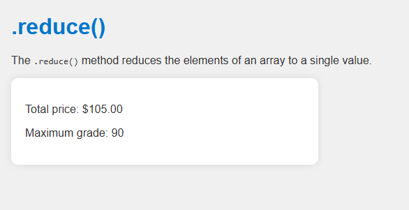

# JavaScript .reduce() Demo

This project demonstrates how to use the `.reduce()` method in JavaScript to process arrays and reduce them to a single value.

## 📌 Description

The `.reduce()` method executes a reducer function on each element of the array, resulting in a single output value. This project showcases:

- Summing an array of prices
- Finding the maximum value in an array of grades

## 💻 Live Demo Preview

 <!-- Optional screenshot -->

## 📁 Project Structure

```

reduce-demo/
├── index.html       # Main HTML file
├── index.js         # JavaScript logic
├── style.css        # Styling for the page
└── README.md        # Project documentation
└── screenshots/image.png #Preview
```

## 🔧 How to Use

1. Download or clone the repository.
2. Open `index.html` in a browser.
3. The results will be displayed on the page and logged in the console.

## ✅ Example Output

```

Total price: \$105.00
Maximum grade: 90

```

## 📚 Learn More

- [MDN Web Docs - Array.prototype.reduce()](https://developer.mozilla.org/en-US/docs/Web/JavaScript/Reference/Global_Objects/Array/reduce)

---

This project is great for beginners learning how to manipulate arrays using `.reduce()` in JavaScript.
```
