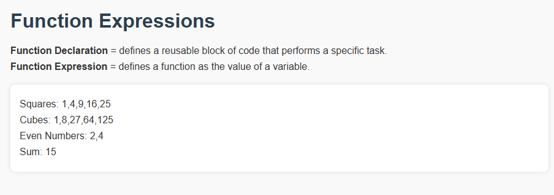

# 🧠 Function Expressions in JavaScript

This mini-project demonstrates the difference between **function declarations** and **function expressions**, including how to use anonymous function expressions with `.map()`, `.filter()`, and `.reduce()`.

## 📌 Key Concepts

- **Function Declaration**: A standard way to define a function.
- **Function Expression**: A function stored in a variable.
- **Anonymous Functions**: Functions without a name, often used as arguments to array methods.

## 💻 Live Demo Preview

 <!-- Optional screenshot -->


## 📁 File Structure

```

function-expressions/
├── index.html       # Main HTML file
├── index.js         # JavaScript logic
├── style.css        # Page styling
└── README.md        # Project documentation
└── screenshots/image.png #Preview
```

## 🚀 What You’ll Learn

- How to define functions using both declaration and expression syntax.
- How to use anonymous functions in array methods.
- How to dynamically display array processing results on the webpage.

## 🧪 Output Example

```

Squares: 1,4,9,16,25
Cubes: 1,8,27,64,125
Even Numbers: 2,4
Sum: 15

```

## 🌐 Try It Out

Open `index.html` in your browser to see the results and inspect the console logs from `setTimeout`.

## 📚 Resources

- [Function Declarations vs Expressions - MDN](https://developer.mozilla.org/en-US/docs/Web/JavaScript/Reference/Functions)
- [JavaScript Array Methods - MDN](https://developer.mozilla.org/en-US/docs/Web/JavaScript/Reference/Global_Objects/Array)

