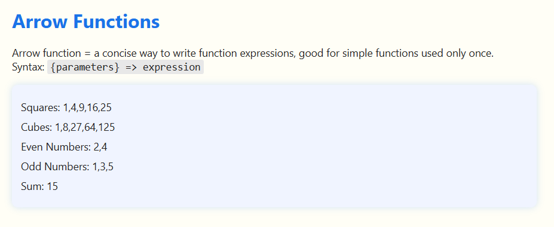

# 🚀 Arrow Functions in JavaScript

This project demonstrates the usage of **arrow functions** — a concise syntax for writing function expressions in JavaScript.

## Key Points

- Arrow functions are shorter and ideal for simple, one-time-use functions.
- They have a more concise syntax compared to function declarations or expressions.
- Frequently used in array methods like `.map()`, `.filter()`, and `.reduce()`.

## Project Structure

```

arrow-functions/
├── index.html    # HTML page displaying explanations and results
├── index.js      # JavaScript code demonstrating arrow functions
├── style.css     # Styling for the page
└── README.md     # Project documentation
└── screenshots/image.png #Preview
```
## 💻 Live Demo Preview

 <!-- Optional screenshot -->


## What You’ll Learn

- How to write arrow functions with no, single, or multiple parameters.
- Using arrow functions inside array iteration methods.
- Differences between arrow functions and traditional functions.

## Example Output

```

Squares: 1,4,9,16,25
Cubes: 1,8,27,64,125
Even Numbers: 2,4
Odd Numbers: 1,3,5
Sum: 15

```

## How to Run

Open `index.html` in a modern browser to view the results and watch the console for additional logs.

## Resources

- [Arrow Functions - MDN](https://developer.mozilla.org/en-US/docs/Web/JavaScript/Reference/Functions/Arrow_functions)
- [JavaScript Array Methods - MDN](https://developer.mozilla.org/en-US/docs/Web/JavaScript/Reference/Global_Objects/Array/map)