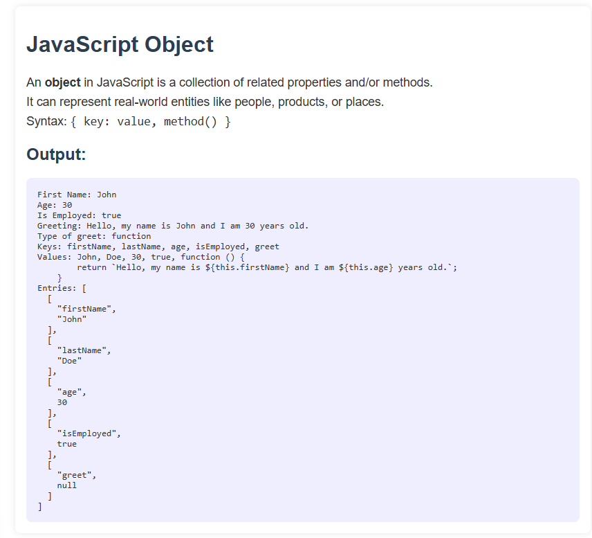

# JavaScript Object Example

This project demonstrates the concept of objects in JavaScript. Objects are used to store keyed collections of various data and more complex entities.

## 👨‍💻 Features

- Create an object with properties and methods
- Access and log object data to the console
- Use built-in JavaScript methods: `Object.keys`, `Object.values`, `Object.entries`
- Custom method using `this` keyword

## 📁 File Structure

```

.
├── index.html
├── style.css
├── index.js
└── README.md

```

## 🖼️ Preview




## 📚 Concepts Used

- JavaScript Objects
- Object Methods
- HTML & CSS Basics
```