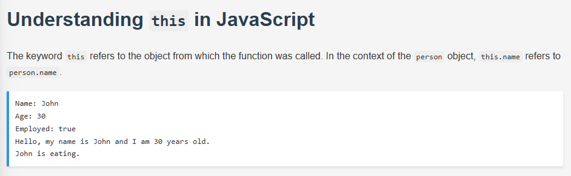

# Understanding `this` in JavaScript

This small web demo helps illustrate how the `this` keyword behaves within an object method in JavaScript.

## 📁 Files Included
- `index.html`: Main HTML page.
- `style.css`: Styling for the content and output display.
- `index.js`: Contains the `person` object and demonstrates the use of `this`.
- `README.md`: This file.

## 🧠 Concept

In the context of an object, `this` refers to the object itself. For example:

```javascript
const person = {
  name: "John",
  greet: function() {
    console.log(this.name); // refers to person.name
  }
};
````

## 🔍 Preview



> 📌 *The preview shows the output displayed on the web page using `pre` and styled with CSS.*

## 💻 Output Example

```text
Name: John
Age: 30
Employed: true
Hello, my name is John and I am 30 years old.
John is eating.
```