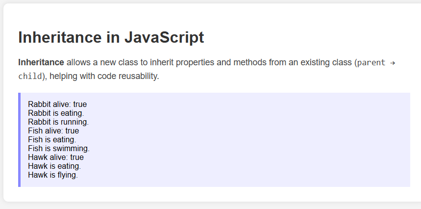

# 🐾 JavaScript Inheritance Demo

This project demonstrates **Inheritance** in JavaScript using simple classes like `Animal`, `Rabbit`, `Fish`, and `Hawk`.

## 📚 Concept

> Inheritance allows a new class (child) to inherit properties and methods from an existing class (parent), promoting **code reusability** and **clean design**.

### ✅ Classes

- `Animal` – Base class with shared properties and methods (`eat`, `sleep`, `alive`)
- `Rabbit`, `Fish`, `Hawk` – Inherit from `Animal` and have their own unique methods (`run`, `swim`, `fly`)

## 🔍 Preview

## 💻 How to Run

1. Clone or download this repository.
2. Open `index.html` in your browser.
3. See the output of each animal's behavior.

## 📁 Files

- `index.html` – Main HTML file
- `style.css` – Basic styling
- `index.js` – Inheritance logic
- `preview.png` – Screenshot of the result

