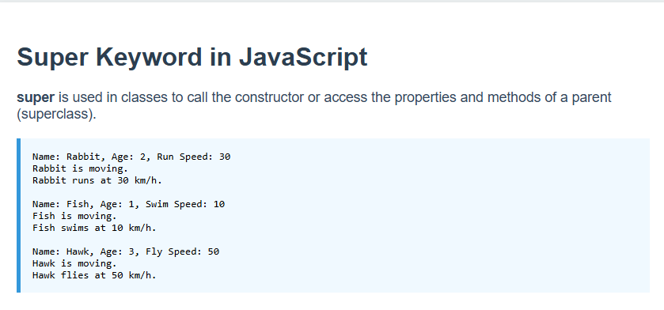

# 🧬 JavaScript `super` Keyword Demo

This project demonstrates the use of the `super` keyword in JavaScript class inheritance.

## 📚 What is `super`?

> The `super` keyword is used in subclasses to call the constructor or methods of the parent class.

### ✅ Classes Overview

- `Animal`: Parent class with common properties (`name`, `age`) and method `move()`.
- `Rabbit`, `Fish`, `Hawk`: Child classes that extend `Animal` and add their own specific behavior.

## 🖼 Preview

## 💻 Run Locally

1. Clone/download the repository.
2. Open `index.html` in your browser.
3. View the console-like behavior in the HTML page.

## 📁 Files

- `index.html` – Main structure
- `style.css` – Page styling
- `index.js` – Class definitions and usage
- `preview.png` – Output screenshot

