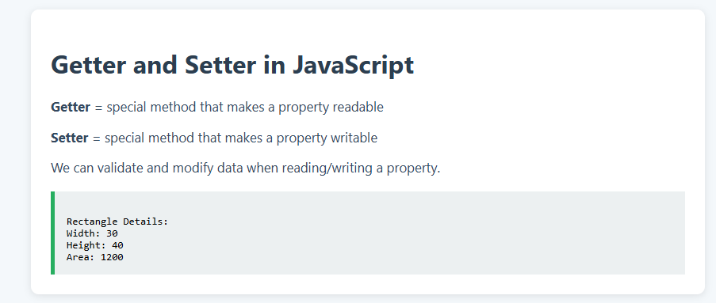

# 📐 Getter and Setter in JavaScript

This project demonstrates how `getter` and `setter` methods work in JavaScript classes for property encapsulation and validation.

## 🧠 Concepts

- **Getter**: Method to access (read) a property.
- **Setter**: Method to update (write) a property, often with validation.
- Both are used to protect and control internal class data.

## ✅ Example Output

```

Rectangle Details:
Width: 30
Height: 40
Area: 1200

```

## 🖼 Preview



## 📂 Files

- `index.html` – Webpage structure
- `style.css` – Styling for layout and design
- `index.js` – Class definition with getter/setter logic
- `preview.png` – Screenshot of the result
