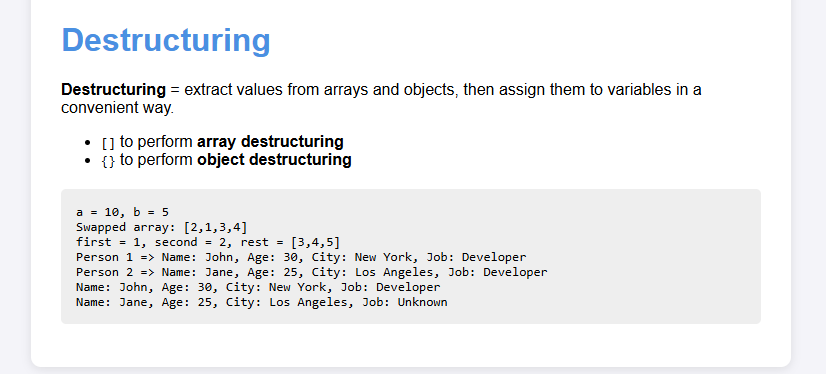

# 📦 JavaScript Destructuring Demo

This simple web demo showcases how destructuring works in JavaScript with both arrays and objects.

## 💡 Features

- Swap variables and array elements
- Extract multiple values from arrays
- Object destructuring with default values
- Destructuring in function parameters

## 📸 Preview

## 📁 Files

- `index.html`: HTML layout
- `style.css`: Styling for better visualization
- `index.js`: Contains JavaScript logic with destructuring examples

## 🧠 Concepts Covered

- Array destructuring
- Object destructuring
- Default values
- Rest parameters
- Destructuring in function parameters
