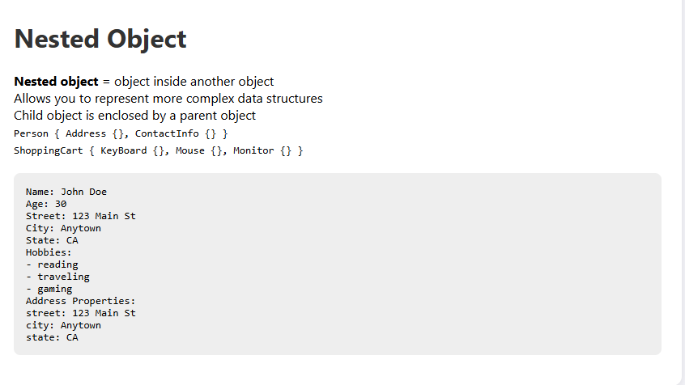

# 🧱 JavaScript Nested Object Demo

This project demonstrates how to define and work with **nested objects** in JavaScript.

## 📖 Description

Nested objects allow you to build structured, hierarchical data. This example includes:

- A `Person` object containing a nested `address` object
- An array of hobbies
- Accessing nested values
- Looping through nested properties

## 📄 Output Preview

## 📁 Files

- `index.html`: Web layout
- `style.css`: Styling for the page
- `index.js`: Main logic and console output to `<pre>` tag
- `preview.png`: Screenshot preview of the page

## 🧠 Concepts Covered

- Object literals
- Nested object access
- `for...of` and `for...in` loops
- DOM manipulation with JavaScript
