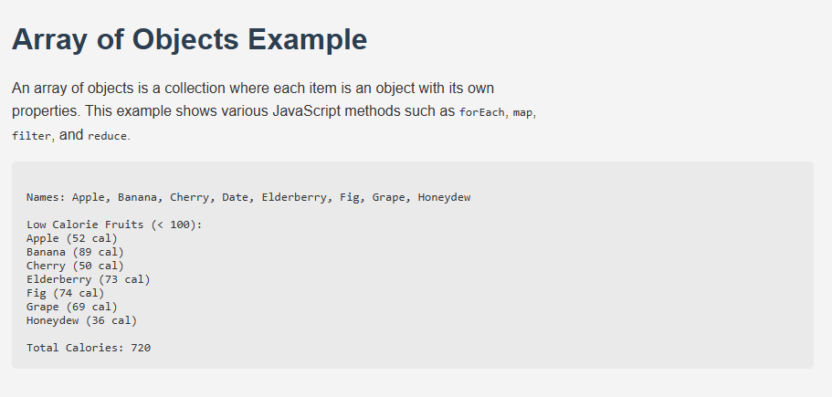

# Array of Objects in JavaScript

This project demonstrates how to use an **array of objects** in JavaScript and apply array methods like:

- `forEach` — to loop through each fruit
- `map` — to extract names
- `filter` — to get fruits with calories < 100
- `reduce` — to calculate total calories

## 💻 Preview

## 📁 Files

- `index.html`: Main HTML structure
- `style.css`: Basic styles
- `index.js`: JavaScript logic

## 🚀 How to Run

1. Clone this repo or download the files.
2. Open `index.html` in a browser.
