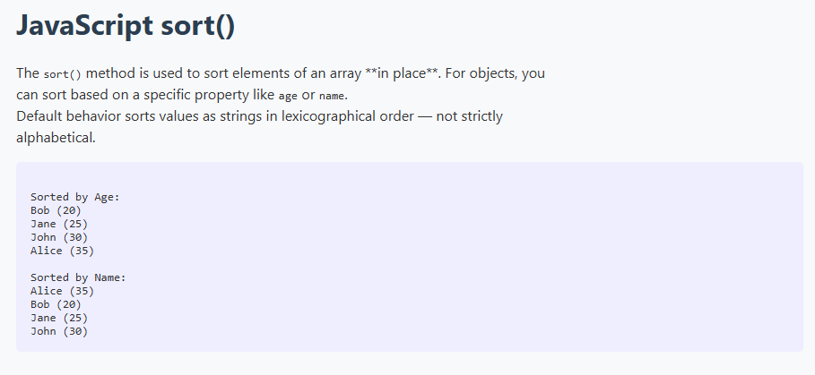

# JavaScript `sort()` with Array of Objects

This simple project demonstrates how to use JavaScript's `sort()` method to:

- Sort an array of objects by numeric property (`age`)
- Sort an array of objects by string property (`name`)

## 🧠 Concepts Used

- `Array.prototype.sort()`
- `localeCompare()` for string comparison
- ES6 spread operator to avoid mutating original data

## 📸 Preview

## 📂 Files

- `index.html` – The HTML page
- `index.js` – Sorting logic
- `style.css` – Styling
- `preview.png` – Preview image

## 🚀 How to Run

1. Clone or download the project.
2. Open `index.html` in your browser.
3. Open the console to see the log output.

