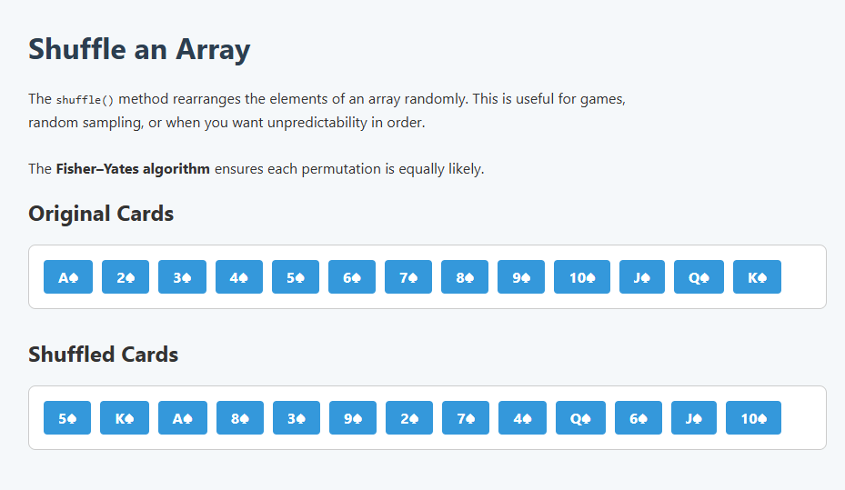

# 🎴 Shuffle an Array with Fisher–Yates Algorithm

This project demonstrates how to shuffle an array randomly using the **Fisher–Yates Shuffle Algorithm**, ensuring that each possible permutation has equal probability.

## 🔍 Description

- Uses a deck of 13 spade cards (A♠ to K♠)
- Displays original and shuffled array in the browser
- Uses clean UI with JavaScript + CSS

## 📸 Preview



## 💻 How to Run

1. Download or clone this repository.
2. Open `index.html` in your browser.
3. View the original and shuffled array.
4. Check the developer console (`F12`) for logs.

## 📂 File Structure

- `index.html` – HTML content and structure
- `index.js` – JavaScript logic (shuffle + render)
- `style.css` – Styling for the page
- `preview.png` – Screenshot preview of the result
- `README.md` – Documentation and guide

## 📚 Algorithm: Fisher–Yates Shuffle

```js
function shuffle(array) {
  for (let i = array.length - 1; i > 0;
