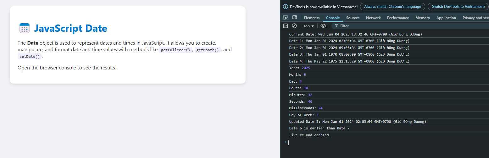

# 📅 JavaScript Date Example

This project demonstrates how to use JavaScript's `Date` object to manipulate and format dates.

## 🧠 What You Will Learn

- How to create `Date` objects using different formats
- How to extract year, month, day, hour, minute, etc.
- How to compare and update dates

## 📸 Preview



## 🧪 Try It Out

1. Open `index.html` in your browser
2. Open the Developer Console (press `F12`)
3. View the logged date operations in the console

## 🛠️ Technologies

- HTML
- CSS
- JavaScript

## 📂 Structure

```

date-example/
├── index.html
├── index.js
├── style.css
└── README.md

```

