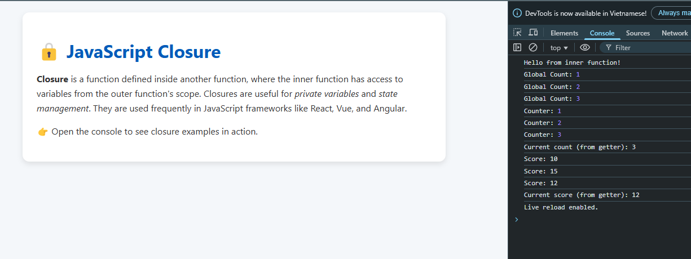

# 🔒 JavaScript Closure Example

This project demonstrates the concept of **Closures** in JavaScript — functions that "remember" the scope in which they were created.

## 📌 What You'll Learn

- How closures work in JavaScript
- How to create private variables
- How closures are used to maintain state
- Common patterns using closures

## 📸 Preview



## 🧪 How to Use

1. Clone or download the project.
2. Open `index.html` in a browser.
3. Open the browser console (`F12` or right-click → Inspect → Console).
4. Observe how closures are used in different examples.

## 🧱 Tech Stack

- HTML
- CSS
- JavaScript

## 📂 File Structure

```

closure-example/
├── index.html        # Main HTML file
├── style.css         # Styling
├── index.js          # JavaScript examples using closure
├── README.md         # Project description
└── preview\.png       # Image preview for README

```

## 🧠 Closure Use Cases

- State management in React
- Encapsulation without classes
- Event listeners and asynchronous functions