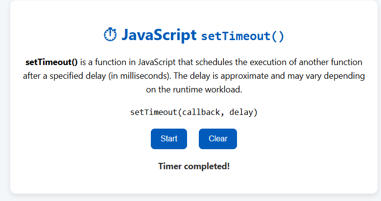

# ⏱ JavaScript `setTimeout()` Demo

This simple web app demonstrates how the `setTimeout()` function works in JavaScript. You can start a timer that will alert "Hello, World!" after 3 seconds, or clear it before it executes.

## 📸 Preview



## 🧪 How to Use

1. Open `index.html` in your browser.
2. Click the **Start** button to initiate the timer.
3. Click **Clear** to cancel the timer before it runs.

## 📘 What is `setTimeout()`?

- `setTimeout(callback, delay)` runs the `callback` after the `delay` in milliseconds.
- It is often used for:
  - Delaying execution
  - Animations
  - Simulating wait or timeout logic

## 📂 Folder Structure

```

setTimeout-example/
├── index.html        # Web UI with buttons and info
├── style.css         # Styling
├── index.js          # JavaScript logic for setTimeout
├── README.md         # Documentation
└── preview.png       # Screenshot preview

```

## 🚀 Tech Used

- HTML
- CSS
- JavaScript
```
