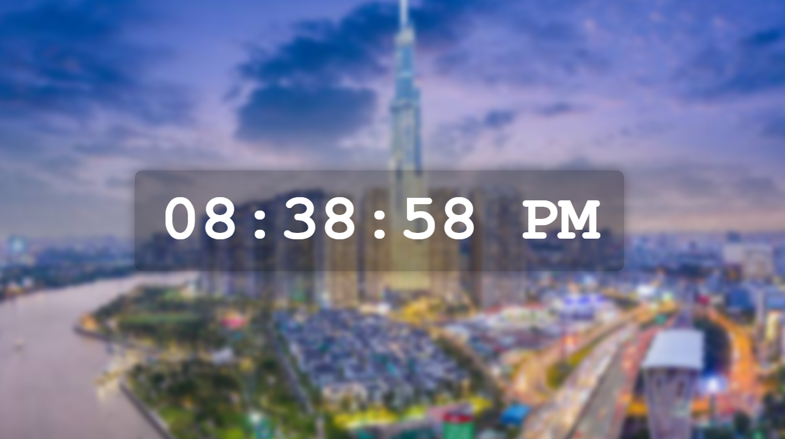

# 🕒 Real-Time Clock (JavaScript)

This project displays a real-time digital clock in 12-hour format using JavaScript, styled with a beautiful blurred background over an image of Landmark 81.

## 📸 Preview



## 🚀 Features

- 12-hour format with AM/PM
- Updates every second in real-time
- Background blur for better readability
- Mobile-responsive layout

## 📂 Folder Structure

```

realtime-clock/
├── index.html        # Main HTML structure
├── style.css         # Styling with background and effects
├── index.js          # Clock logic using JavaScript
└── preview\.png       # Screenshot preview

```

## 🧠 Technologies

- HTML5
- CSS3 (with backdrop-filter)
- JavaScript (setInterval, Date object)

## 💡 Tip

This is a great starting point to build widgets like:
- Clocks
- World time converters
- Alarms and timers
