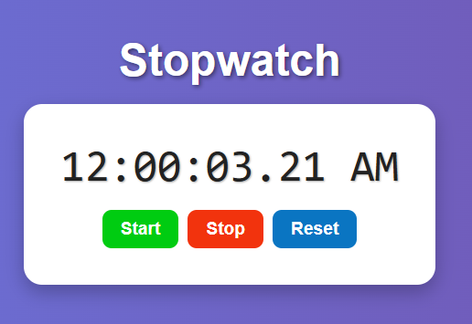

# ⏱️ Stopwatch Web App

A simple stopwatch built with HTML, CSS, and JavaScript.  
Includes Start, Stop, and Reset functionality, along with a clean UI and AM/PM format.

## 💡 Features

- Real-time stopwatch
- Millisecond precision (rounded to 1/100 second)
- AM/PM 12-hour format
- Responsive and styled with gradient background

## 🚀 Usage

1. Open `index.html` in your browser.
2. Click `Start` to begin the stopwatch.
3. Click `Stop` to pause it.
4. Click `Reset` to reset to `00:00:00.00 AM`.

## 📁 Files

- `index.html`: Main HTML structure
- `style.css`: Custom styles
- `index.js`: Stopwatch functionality
- `preview.png`: UI Preview

