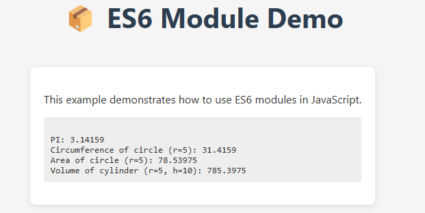

# 📦 ES6 Module Demo

This is a simple project demonstrating how to use **JavaScript ES6 modules** (`import` / `export`) in the browser.

## 🔧 Technologies Used

- HTML5
- CSS3
- JavaScript (ES6 modules)

## 📁 Project Structure
```
es6-module-demo/
├── index.html
├── index.js
├── mathUtil.js
├── style.css
├── preview\.png
└── README.md
```

## 🚀 Demo



## 🧠 Features

- Modular JavaScript code with `export` / `import`
- Reusable math utility functions
- Styled interface with clean layout

## 📚 Concepts Demonstrated

- ES6 module syntax
- DOM manipulation
- Basic math functions

