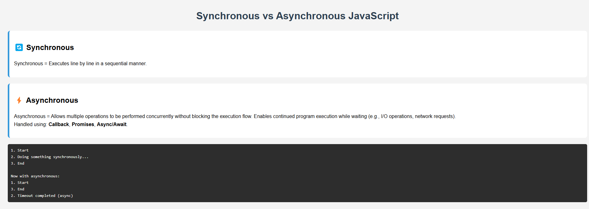

# 🔄 Synchronous vs ⚡ Asynchronous JavaScript

This project demonstrates the basic difference between **synchronous** and **asynchronous** operations in JavaScript.

## 🧠 Key Concepts

### 🔄 Synchronous
- Executes code line by line.
- Each operation waits for the previous one to finish.

### ⚡ Asynchronous
- Executes operations concurrently.
- Does **not block** the program.
- Uses callbacks, promises, or async/await.

## 💻 Demo Output

Code uses `setTimeout()` to demonstrate asynchronous behavior.

## 📁 Project Structure

```

sync-vs-async/
├── index.html
├── index.js
├── style.css
├── preview\.png
└── README.md

```

## 🖼️ Preview



