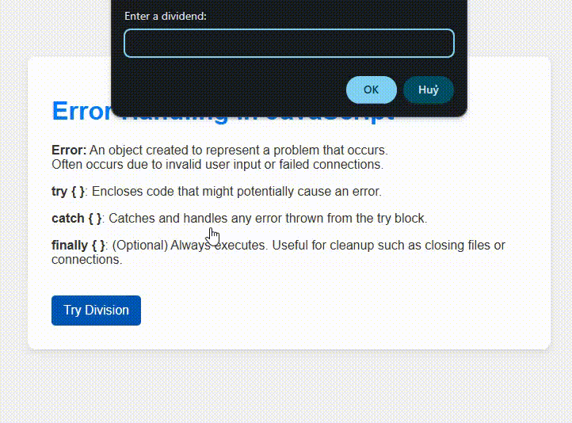

# JavaScript Error Handling Demo

This simple project demonstrates basic error handling in JavaScript using `try`, `catch`, and `finally`.

## Features

- Prompts user for a dividend and divisor.
- Validates inputs and prevents division by zero.
- Shows error messages via `alert()` and logs them in the console.

## Preview

## How to Run

1. Open `index.html` in a web browser.
2. Click the "Try Division" button.
3. Enter numeric values when prompted.

## Files

- `index.html` — Main HTML structure.
- `style.css` — Styling for layout and buttons.
- `index.js` — JavaScript with error handling.
- `screenshot.png` — UI preview.
