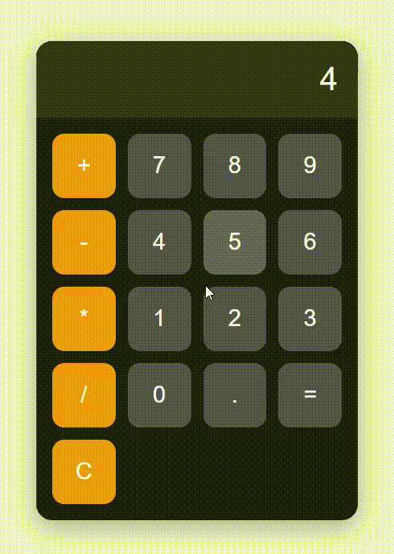

# 🧮 Simple Web Calculator

This is a simple, styled web-based calculator built with HTML, CSS, and JavaScript.

## 🖼️ Preview

## 🚀 Features

- Basic arithmetic operations: `+`, `-`, `*`, `/`
- Real-time input display
- Styled buttons with hover and active effects
- Responsive and centered layout

## 📁 Files

- `index.html`: Main HTML file
- `style.css`: Styling and layout
- `index.js`: Functionality and logic
- `screenshot.png`: Visual preview

## ✅ How to Use

1. Download the project folder.
2. Open `index.html` in any web browser.
3. Use the buttons to perform calculations.
