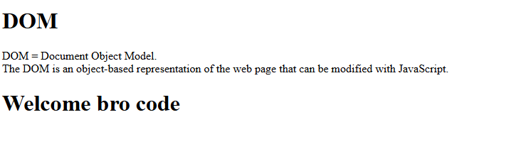

# My Website - DOM Example

This project demonstrates basic DOM manipulation using JavaScript.

## 📷 Screenshot

## 🧠 Description

- Changes the background color of the page with CSS
- Dynamically appends a welcome message depending on the username
- Demonstrates how the DOM can be accessed and modified

## 📂 Files

- `index.html` – HTML content
- `styles.css` – Styling for the page
- `index.js` – JavaScript for DOM manipulation
- `screenshot.png` – A screenshot of the app in the browser

## 🚀 How to Run

Open `index.html` in your browser.
