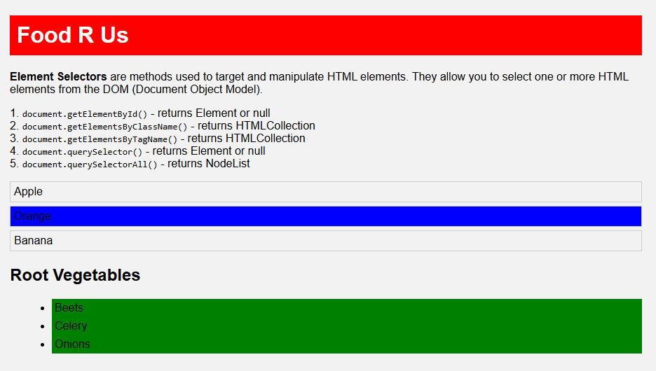

# 🍇 Element Selectors in JavaScript

This project demonstrates different methods to select and manipulate DOM elements using JavaScript.

## 🧪 Selectors Covered
- `getElementById()`
- `getElementsByClassName()`
- `getElementsByTagName()`
- `querySelector()`
- `querySelectorAll()`

## 💻 Preview

## 📁 Files
- `index.html` – Main HTML structure.
- `style.css` – Basic styling.
- `index.js` – DOM manipulation using selectors.

## 🚀 How to Run
1. Download or clone this repo.
2. Open `index.html` in a browser.
3. Open DevTools to see the console logs.
