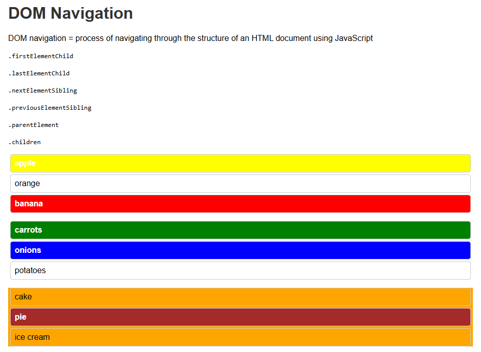

# DOM Navigation Demo

This project demonstrates how to navigate the DOM (Document Object Model) using JavaScript. The key DOM properties covered include:

- `.firstElementChild`
- `.lastElementChild`
- `.nextElementSibling`
- `.previousElementSibling`
- `.parentElement`
- `.children`

## 🔍 Example Output

The script highlights different elements within the lists using various background colors to show how each property works in action.

## 📸 Screenshot

## 📂 Files

- `index.html` — The main HTML structure.
- `index.js` — JavaScript logic for DOM navigation.
- `dom-navigation.png` — Screenshot showing the highlighted DOM elements.

## ✅ How to Use

1. Open `index.html` in your browser.
2. Inspect the elements that change color—each represents a DOM navigation method in action.
